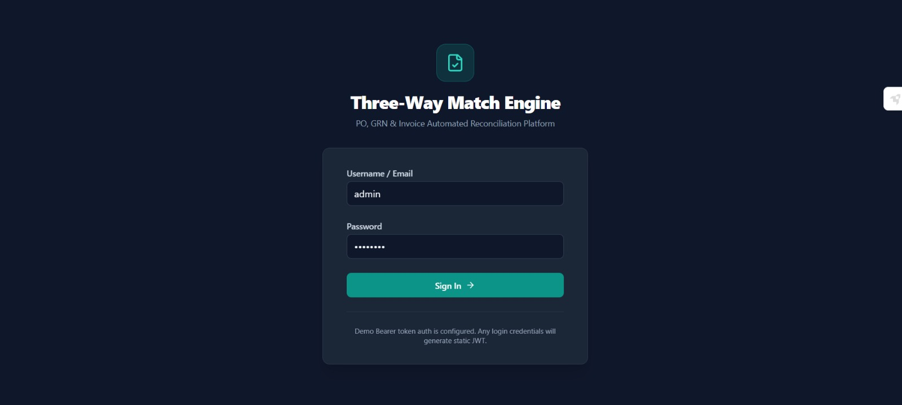
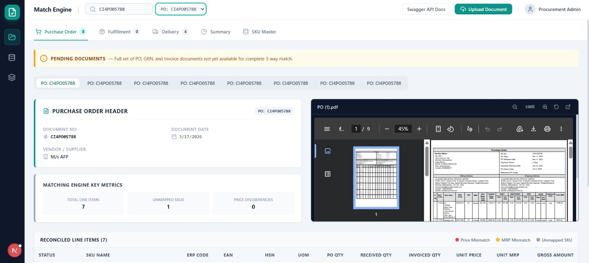
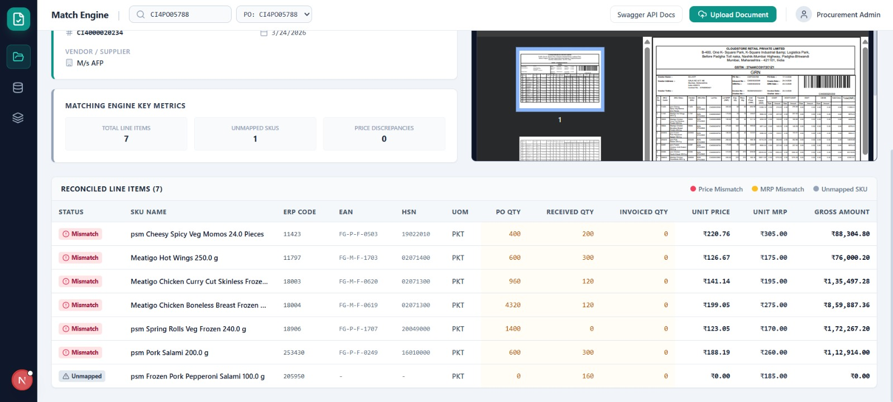
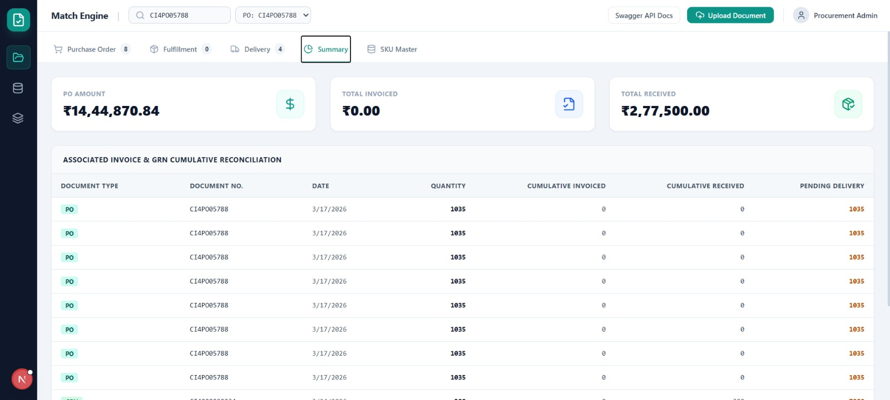
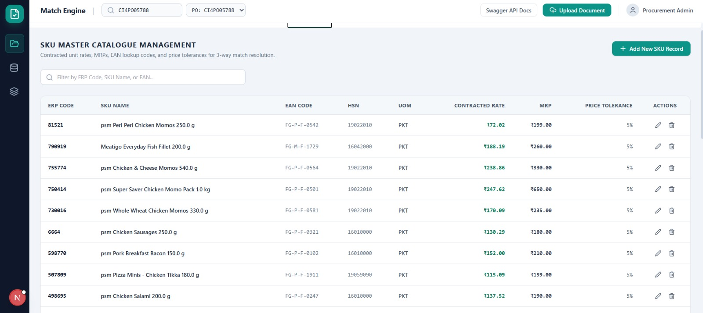

# Three-Way Match Engine for PO, GRN, and Invoice

A full-stack procurement reconciliation application built with **Next.js (App Router)**, **TypeScript**, **Tailwind CSS**, **TanStack Query**, **Express**, **MongoDB (Mongoose)**, and **Gemini API** for automated document extraction and three-way matching.

---

## Screenshots







## 🌟 Overview & Key Features

In procurement, a single purchase is documented across three stages:
1. **Purchase Order (PO)**: What was ordered from the vendor.
2. **Goods Receipt Note (GRN)**: What was actually received at the warehouse.
3. **Invoice**: What the vendor is billing for.

This application automates the reconciliation across all three documents end-to-end:
- **Document Processing**: Upload PO, GRN, or Invoice (PDF or image).
- **AI Extraction**: Uses Gemini API to extract structured header & item details. Includes fallback parser for offline/test environments.
- **SKU Master Resolution**: Look up vendor item codes (`skuErpCode` or `eanCode`) against the SKU Master catalogue so line items match even when raw document text differs.
- **Dynamic Three-Way Matching**: Recomputes item-level quantity, price, and MRP comparisons across stored documents dynamically on every request.
- **Out-of-Order Upload Robustness**: Documents are linked by `poNumber` string, enabling GRN/Invoice to be uploaded before PO exists.
- **Duplication Safeguards**: Flags duplicate POs or duplicate document numbers per PO without dropping data.
- **Interactive UI**: Tabbed interface (`Purchase Order`, `Fulfillment`, `Delivery`, `Summary`, `SKU Master`) matching reference layouts, with PDF/Image preview, zoom controls (`-`, `%`, `+`), mismatch cell highlighting, and unmapped SKU warnings.

---

## 🚀 Quick Start & Installation

### Prerequisites
- Node.js v18+
- npm v9+

### Setup Instructions

1. **Clone & Install Dependencies**
   ```bash
   npm install
   ```

2. **Configure Environment Variables**
   Copy `.env.example` to `.env`:
   ```bash
   cp .env.example .env
   ```
   *Note: If `MONGODB_URI` is left blank, the server automatically boots an in-memory MongoDB instance (`mongodb-memory-server`) out of the box! If `GEMINI_API_KEY` is not set, fallback parser extracts sample documents seamlessly.*

3. **Run Dev Environment (Backend + Frontend)**
   ```bash
   npm run dev
   ```
   - **Frontend App**: `http://localhost:3000`
   - **Backend API**: `http://localhost:5000`
   - **Swagger API Docs**: `http://localhost:5000/api-docs`

4. **Run Automated Test Suite**
   ```bash
   npm test
   ```

5. **Build for Production**
   ```bash
   npm run build
   npm start
   ```

---

## 🏗️ Technical Architecture & Data Model

### Data Models (MongoDB / Mongoose)

- **`SkuMaster`**:
  - `skuErpCode` (string, unique, index) - primary vendor code
  - `name` (string) - product title
  - `eanCode` (string) - alternate lookup key
  - `hsnCode`, `uom`
  - `agreedRate` (number) - contracted unit price
  - `mrp` (number)
  - `priceTolerance` (number, default 0.05 = 5%)

- **`PurchaseOrder`**:
  - `poNumber` (unique string index)
  - `poDate` (Date)
  - `vendorName` (string)
  - `items[]`: `{ itemCode, description, quantity, unitRate, mrp, skuMaster (ref: SkuMaster) }`
  - `rawParsed` (Mixed) - unmodified Gemini output
  - `filePath`, `originalFilename`, `mimeType`

- **`Grn`**:
  - `grnNumber` (string)
  - `poNumber` (string link key - PO need not exist yet)
  - `grnDate` (Date)
  - `items[]`: `{ itemCode, description, receivedQuantity, mrp, skuMaster (ref: SkuMaster) }`

- **`Invoice`**:
  - `invoiceNumber` (string)
  - `poNumber` (string)
  - `invoiceDate` (Date)
  - `items[]`: `{ itemCode, description, quantity, unitRate, mrp, skuMaster (ref: SkuMaster) }`

- **`MatchAudit`**:
  - `poNumber` (string)
  - `steps[]`: `{ step, status, message, at }` - upload & processing audit log

---

## 🔍 Master Resolution & Matching Rationale

### Master Resolution Strategy
Document raw text frequently varies across vendors and warehouses (e.g. PO: `BIK-BIKANERI-200G` vs GRN: `Bikaji Bikaneri Bhujia 200 G`).
1. Lookup `SkuMaster` where `skuErpCode == itemCode` (case-insensitive, whitespace trimmed).
2. If not found, lookup where `eanCode == itemCode`.
3. If resolved: link `skuMaster = SkuMaster._id`.
4. If unresolved: leave `skuMaster` unset and flag soft warning `unmapped_master_sku`.
5. **Why this design?**: Documents are never blocked from storage due to unmapped SKUs. When missing SKU Master records are added later, recomputing the match automatically resolves the items!

### Out-of-Order Upload Handling
Documents are linked strictly by the `poNumber` string rather than database foreign keys to existing PO records. An Invoice or GRN can arrive and be stored before the PO exists.

### Three-Way Matching Rules & Status Logic
Recomputed on every `GET /match/:poNumber` call from current stored documents:

| Reason Code | Rule / Condition | Violation Type |
|---|---|---|
| `grn_qty_exceeds_po_qty` | Total received qty (all GRNs) > PO qty for item | Hard |
| `invoice_qty_exceeds_grn_qty` | Total invoiced qty (all Invoices) > total GRN qty | Hard |
| `invoice_qty_exceeds_po_qty` | Total invoiced qty (all Invoices) > PO qty | Hard |
| `invoice_date_after_po_date` | Invoice date > PO date | Hard |
| `duplicate_po` | Second PO uploaded for existing `poNumber` | Hard |
| `duplicate_document` | Duplicate GRN or Invoice number under same `poNumber` | Hard |
| `item_missing_in_po` | Line item on GRN/Invoice not on PO | Hard |
| `price_mismatch` | Invoice `unitRate` differs from `agreedRate` > `priceTolerance` | Soft Warning |
| `mrp_mismatch` | Invoice/GRN `mrp` differs from `SkuMaster.mrp` > 1% | Soft Warning |
| `unmapped_master_sku` | Item code not found in SKU Master catalogue | Soft Warning |

#### Status Derivation
- `insufficient_documents`: Missing PO, GRN, or Invoice document set.
- `mismatch`: Contains 1+ hard violation.
- `partially_matched`: No hard violations, but quantities incomplete or soft warnings exist.
- `matched`: Fully reconciled across PO + GRN + Invoice with 0 violations/warnings.

---

## 🎨 Frontend Architecture & State Management Choice

- **Framework**: Next.js 15 (App Router) + TypeScript + Tailwind CSS.
- **State Management Choice**: **TanStack Query (React Query)**.
  - *Justification*: The database is the single source of truth for dynamic match calculations. TanStack Query provides instant server-state fetching, caching, automatic query invalidation on upload/edits, and optimistic UI updates without manual Redux boilerplate.

---

## 📋 API Endpoints

- `POST /auth/login` → `{ token }`
- `POST /documents/upload` → Upload multipart document (`file`, `documentType`)
- `GET /documents?type=&poNumber=` → List stored documents
- `GET /documents/:id` → Get document details
- `GET /documents/:id/file` → Stream original file for preview iframe/image
- `GET /match/:poNumber` → Compute dynamic 3-way match
- `GET /summary/:poNumber` → Get PO summary stats & document history table
- `POST|GET|PATCH|DELETE /masters/sku` → SKU Master CRUD management
- `GET /api-docs` → Interactive Swagger UI Documentation

---

## 🤖 AI Assistants Used
- **Google Antigravity / Gemini 3.6 Flash (Medium)**: Used for architecture planning, schema design, document extraction prompt engineering, and code generation.

---

## 📄 License & Author
Built for Full-Stack Developer Assessment.
